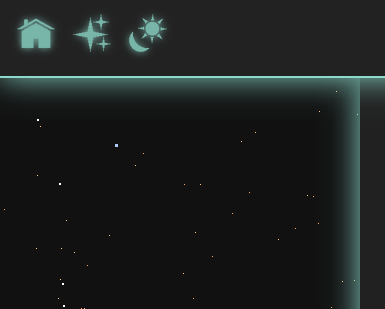

# Chocomint CSS
Minimal CSS framework based on [Simple CSS](https://simplecss.org/), with some extra effects.

# About
Visit the [demo site](https://diegobarmor.github.io/chocomint-css/) for a preview of Chocomint CSS. Build similar sites following the [template](template).
